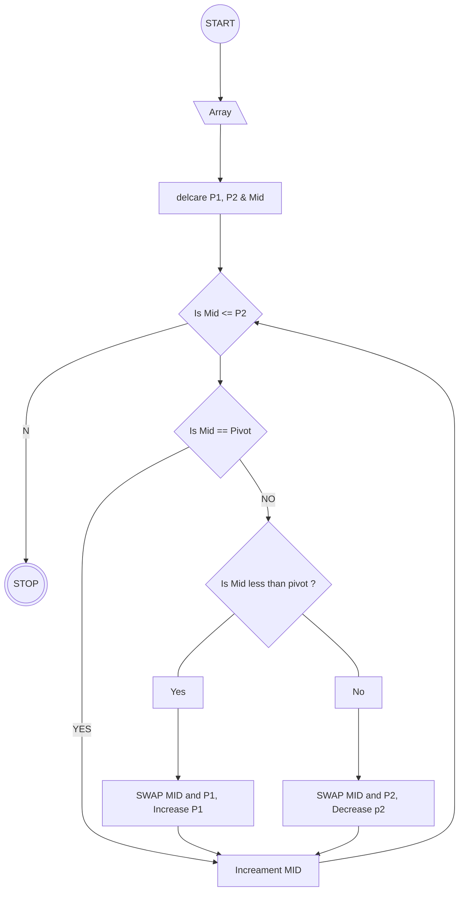

# Dutch National Flag Problem

- Write a program that takes an array A and index i into A,
- and rearranges the elements such that
- all elements less than A[i] (the "pivot") appear first,
- followed by elements equal to the pivot, followed by elements greater than the pivot.

